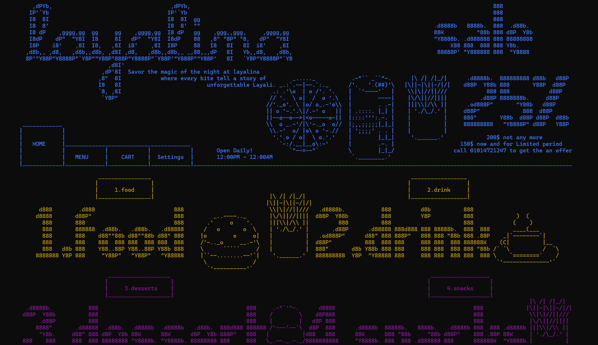

# 🌟 Layalina Restaurant Management System



A premium, interactive **Console Application** built entirely in **C** that brings a restaurant's digital presence to life directly within the terminal. With gorgeous custom ASCII art interfaces, advanced role-based management (Customer, Staff, Boss), and full persistent data storage, **Layalina** bridges retro terminal design with modern system capabilities.

---

## 🎨 Visual Interfaces & Dynamic Styling
Unlike typical terminal applications, **Layalina** is designed to look like a polished, responsive application:
- **Interactive Themes:** Fully responsive dynamic switching between modern **Dark Mode** and crisp **Light Mode** at runtime.
- **ASCII Art UI:** Renders rich visual banners, customized text formatting, and graphic borders using raw `.txt` designs.
- **Windows Console Styling:** Leverages native Windows API handles to deliver vibrant, colored UI components tailored to individual menu items (like golden pizzas, green salads, and neon aqua drinks).

---

## 🚀 Key Features

### 👤 1. Customer Mode
- **Browse Categories:** Explore a structured, colored menu consisting of *Food, Drinks, Desserts, and Snacks*.
- **Shopping Cart Management:** Add items, dynamically adjust quantities, and instantly view real-time totals.
- **Easy Checkout:** Enter delivery coordinates, process orders, and generate real-time receipts.
- **Account Control:** Complete login/signup system with features to update email, change password, view purchase history, or close accounts.

### 💼 2. Boss (Admin) Mode
- **Menu Management:** Add, edit, or remove items in real-time. Change item category, price, styling color, or link to unique ASCII design files.
- **Staff Operations:** Monitor salaries, record attendance, and keep track of employee status.
- **Sales Analytical Hub:** Calculate total revenue, view detailed transaction logs, and analyze customers' shopping behavior.

---

## 💾 Native Persistence Layer
The program features a complete, lightweight file-based database. It securely loads and stores all operational data:
* **Accounts Database:** `usernames.txt`, `passwords.txt`, `emails.txt`
* **Menu Architecture:** `menu_name.txt`, `menu_price.txt`, `menu_category.txt`, `menu_color.txt`, `menu_design.txt`
* **Ledgers & Orders:** `orders.txt`, `totalsales.txt`, `totalsales_email.txt`

---

## 🛠️ Getting Started

### Prerequisites
* **Operating System:** Windows (uses `<windows.h>` for color formatting).
* **Compiler:** Any standard C compiler (GCC, Clang) or **Code::Blocks IDE**.

### How to Compile and Run

#### 💻 Via Code::Blocks (Recommended)
1. Open the project project file `layalina.v.2.2.1.cbp` in Code::Blocks.
2. Click **Build and Run** (or press `F9`).

#### 🖳 Via GCC Command Line
Open your terminal in the repository folder and execute:
```bash
gcc main.c -o layalina.exe
./layalina.exe
```

---

*Made with 💖 by CTRL+Z Team.*
